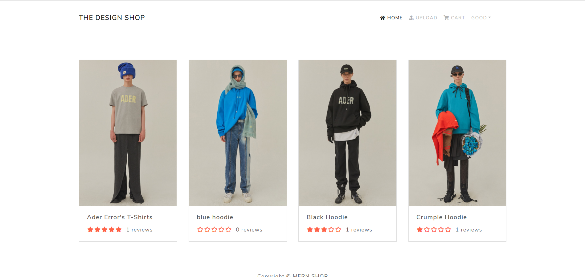

# React-MERN SHOP


```
React와 Express.js로 개발한 풀스택 쇼핑몰 사이트입니다.
JWT를 이용한 회원가입 및 로그인, Redux를 활용한 장바구니 시스템 구현, Redux-Thunk를 이용하여
비동기 데이터통신을 하여 로그인, 게시글 작성 및 리뷰작성 기능을 도입했습니다.
또한 AWS S3를 이용하여 이미지 처리 및 저장을 하였습니다.
```

--------------------------------------------
#### 완성된 페이지
  

--------------------------------------------

### 사용한 플러그인
```
- React.js
- Redux
- Redux-Thunk
- React-Bootstrap
- Axios
- Express.js
- MongoDB
- AWS S3
- bcrypt
- multer
```

### portfolio site
https://react-shop-1949.herokuapp.com/
